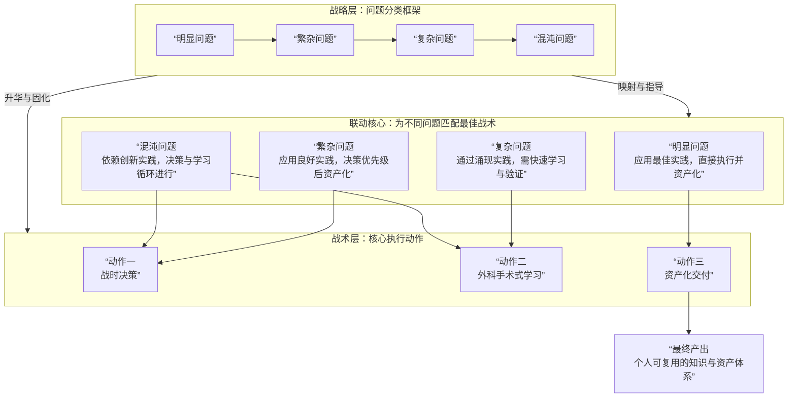

# 工程问题分类

| 问题层级 | 影响范围 | 认知状态 | 核心特征 | 应对实践 | 目标状态 |
|:---------|:---------|:---------|:---------|:---------|:---------|
| **明显问题** | 单点级 | **已知已知** | 方案确定，有熟悉的、确定的途径 | **最佳实践** | 能在普遍约束内稳定 |
| **繁杂问题** | 模块级 | **已知未知** | 有序的、可预判的 | **良好实践** | 能在约束内稳定 |
| **复杂问题** | 产品级 | **未知未知** | 耦合但模式可辨，处于动态约束中 | **涌现实践** | 稳定但可动 |
| **混沌问题** | 解决方案级 | **不可知未知** | 状态临时且易变，旧的不确定性不再适用 | **创新实践** | 探索新秩序，实现破局 |

