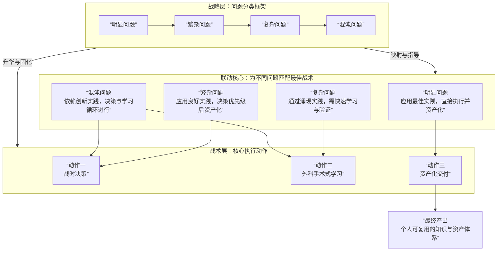

## 工程问题分类

| 问题层级 | 影响范围 | 认知状态 | 核心特征 | 应对实践 | 目标状态 |
|:---------|:---------|:---------|:---------|:---------|:---------|
| **明显问题** | 单点级 | **已知已知** | 方案确定，有熟悉的、确定的途径 | **最佳实践** | 能在普遍约束内稳定 |
| **繁杂问题** | 模块级 | **已知未知** | 有序的、可预判的 | **良好实践** | 能在约束内稳定 |
| **复杂问题** | 产品级 | **未知未知** | 耦合但模式可辨，处于动态约束中 | **涌现实践** | 稳定但可动 |
| **混沌问题** | 解决方案级 | **不可知未知** | 状态临时且易变，旧的不确定性不再适用 | **创新实践** | 探索新秩序，实现破局 |

## 实践框架
由于历史条件和现实生活的约束，务必抛弃对于完善知识体系的冲动而保留对辩证法的运用。
下面是一些关键的限制性因素：
- 精力有限-寻求重点
- 知识不足-对点攻坚
- 阶段结项-复用积累
由于我们当下的生产关联甚广，请务必在社区中完成劳动。

核心原则：让每一次实践都物化为可复用的资产
目标不是“学会”，而是“能一次又一次地、更高效地解决新问题”。以下三个动作是实现这一目标的唯一路径。

动作一：确立“战时决策”优先级
在投入任何工作前，用以下三个问题过滤所有任务：
- “它能产生一个可运行的东西吗？” （可行性优先）：优先选择能快速验证的方案。一个能运行的简单方案，胜过一堆复杂但无法落地的设计。
- “它是当前最大的瓶颈吗？” （阻塞性优先）：将全部火力集中于那个让整个系统停滞的关键矛盾上。忽略所有可以绕行的次要问题。
- “解决它能终结一类问题吗？” （杠杆效应优先）：优先解决那些能为你带来长期复利的问题（如搭建一个通用的部署流程），而非一次性的技巧。
产出： 一份清晰的、按优先级排序的 “本周作战任务清单” 。

动作二：执行“外科手术式”学习
当实施“作战任务”遇到无法绕过的知识壁垒时，按如下流程进行学习：
- 精准定位： 使用工具（如调试器、性能剖析器）将问题锁定到具体的代码行、配置项或错误信息。
- 最小化学习： 围绕这个具体问题点，搜索解决方案。你的学习范围应严格控制在 “解决眼前问题所需的最小知识范围” 内。
- 即时验证： 将学到的方案立即应用于实践，观察问题是否被解决。如果无效，撤回并换方案，而非深究理论。
产出： 一个被修复的Bug或一个被验证的功能，以及一段与之绑定的、可复用的解决方案代码片段。

动作三：完成“资产化”交付
- 在每个任务（如完成一个赛事、解决一个核心Bug）结束后，不进行空泛的总结，而是进行资产清点：
- 提炼“模式”： 问自己：“这次成功的解决方案，哪些部分下次能直接拿来用？” 将其保存为代码模板或配置模板，存入 /_assets 目录。
- 标记“陷阱”： 问自己：“哪个Bug耗费我最多时间？如何快速识别和绕过它？” 在代码注释或项目README中用三句话记录：现象、根因、解法。
- 优化“启动器”： 确保你的项目带有一个 README.md，其核心内容是 “如何用最少的命令一键启动”。
产出： 一个持续增长的、属于你个人的 “军火库”（/_assets） 和 “雷区地图”（注释/README） 。

社区的唯物运用：作为“侦察与补给”
将社区（GitHub、论坛）视为你个人能力的延伸，而非学习的目的地。
侦察： 在“外科手术式学习”阶段，用具体错误信息搜索，了解前人的攻克路径。
补给： 当无法独立解决时，精准地描述你的“正题”（目标）与“反题”（冲突），在社区提问。解决问题后，回去公布你的“合题”（方案），完成一次贡献。

## 联动关系

联动一：用“动作一”来界定和划分问题类型
“战时决策”三问，本身就是判断问题属性的诊断工具。

问题类型	| 如何用“动作一”进行界定
- 明显问题	能产生可运行物吗？ → 是。最大的瓶颈？ → 不是（通常）。能终结一类问题吗？ → 是（通过资产化）。
- 繁杂问题	能产生可运行物吗？ → 是。最大的瓶颈？ → 可能是。能终结一类问题吗？ → 是（建立流程和模块）。
- 复杂问题	能产生可运行物吗？ → 可能只是一个原型。最大的瓶颈？ → 很可能就是它。能终结一类问题吗？ → 未知，但探索出的模式极具价值。
- 混沌问题	能产生可运行物吗？ → 目标是先创造一个“安全岛”。最大的瓶颈？ → 绝对是它。能终结一类问题吗？ → 如果能，就是开创性的。
结论：在您用“动作一”过滤任务、排列优先级时，您已经在无意识地对问题进行归类，并为其匹配相应的解决心态。

联动二：用“动作二”来应对不同问题所需的学习
“外科手术式学习”是解决“已知未知”和“未知未知”问题的核心手段。

问题类型	| 如何应用“外科手术式学习”
- 明显问题	基本不需。知识体系完善，直接应用“最佳实践”。
- 繁杂问题	偶尔需要。当遇到某个不熟悉的模块API或配置时，进行精准学习。
- 复杂问题	核心动作。面对涌现的模式和动态约束，需要不断精准定位、最小化学习、即时验证，通过试错来探明路径。
- 混沌问题	生存法则。没有现成路径，必须通过快速、小范围的“手术”来实验各种可能性，找到那个能建立秩序的突破口。
结论：问题的复杂性越高，“外科手术式学习”的价值就越大。它确保了在知识不足的情况下，学习行为始终服务于“产生可运行物”这个唯物目标。

联动三：用“动作三”将各类问题的解决过程“物化”为资产
“资产化交付”是贯穿始终的唯物原则，它将解决任何类型问题的经验，固化为可复用的“已知已知”。

问题类型	| 如何通过“动作三”进行资产化
- 明显问题	产出 “最佳实践”模板。例如：标准配置片段、项目脚手架。这是最直接、复用率最高的资产。
- 繁杂问题	产出 “良好实践”流程与模块。例如：自动化脚本、封装好的组件、部署清单。
- 复杂问题	产出 “涌现模式”记录和 “雷区地图”。记录下哪些路径走通了，哪些是坑。这些是应对不确定性的宝贵经验。
- 混沌问题	产出 “创新实践”原型和 “破局点”验证。哪怕只是一个不成熟的想法，其验证过程本身也是资产，它标定了一条“此路不通”或“此路可通”的边界。

结论：无论问题多复杂，“动作三”强制进行资产清点，确保每一次实践都不是一次性消费，而是对个人“军火库”的一次扩充。今天在“复杂”或“混沌”问题中耗费精力换来的经验，通过资产化，明天就可能成为团队里某个人的“明显”问题。
